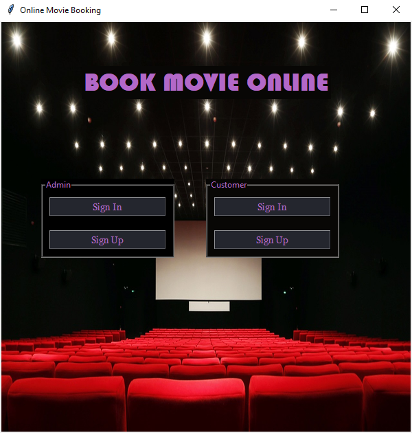
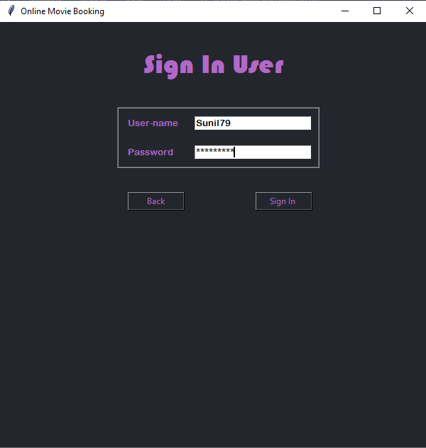
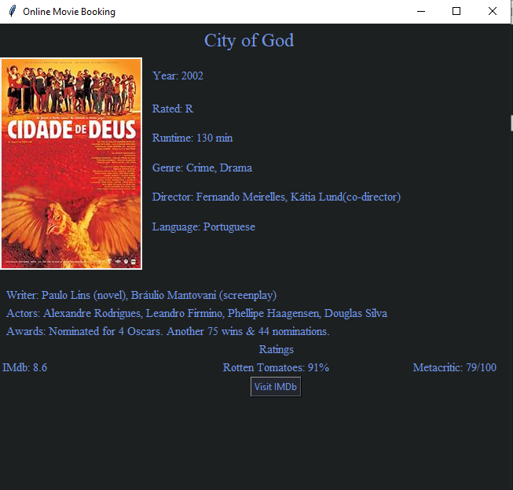
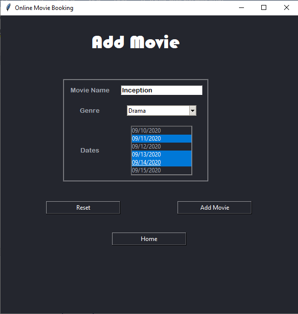
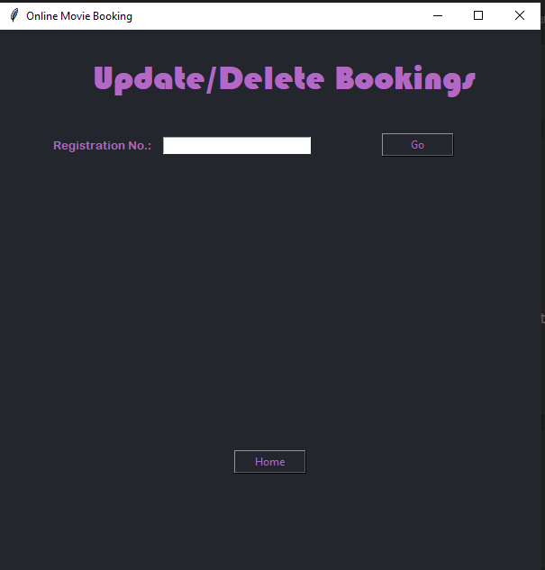
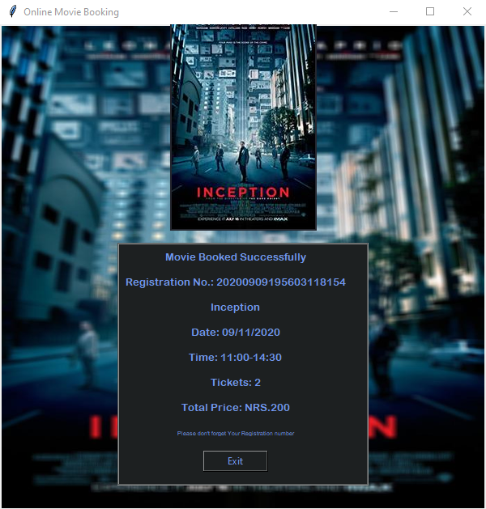
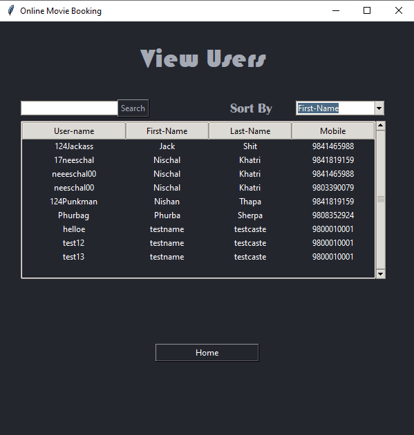

# Online-Movie-Booking-UI
Simple Movie Booking System created with Python and MySQL to perform Activitie such as view movie bookings, book a movie, delete a bookings on user end 
Also as an Admin one can create a movie listing, update, delete the booking with an integration of third party api OMDB to download and show movie details as the part of final booking confirmation.

## Tools And Technologies Used
- MySQL
- Python 
- Tkinter
- OmDb API

## User Interface Screens:
### Home Page

### Movie Booking Confirmation

### Movie Details with OmDb fetch

### Other Screens

